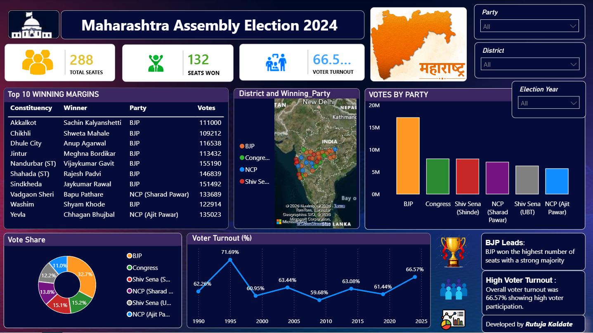

# Maharashtra Assembly Election 2024 - Power BI Dashboard

## Project Overview
This Power BI dashboard provides an interactive analysis of the Maharashtra Assembly Election 2024.  
It highlights total seats, winning seats, voter turnout, top winning margins, district-wise party performance, vote share, and party-wise vote comparison.

## Dashboard Highlights
- Total seats in Maharashtra Assembly
- Seats won by leading party/alliance
- Overall voter turnout percentage
- Top 10 winning margins by constituency
- District-wise winning party map
- Votes by party comparison
- Vote share donut chart
- Historical voter turnout trend

## Tools Used
- Power BI
- Excel / CSV
- Data Cleaning
- Data Visualization
- Dashboard Design

## Key Insights
- BJP emerged as the leading party in terms of seats.
- Overall voter turnout remained strong at around 66.57%.
- Vote share was split among BJP, Congress, Shiv Sena, NCP factions, and other parties.
- District-level visualization helps identify regional political patterns.

## Files in this Repository
- `Maharashtra_Assembly_Election_2024.pbix` – Power BI dashboard file
- `dataset.xlsx` / `dataset.csv` – source dataset
- `Maharashtra_Assembly_Elaction_2024.png` – dashboard preview image

## Dashboard Preview

## Skills Demonstrated
- Data Cleaning
- Data Modeling
- DAX Basics
- Dashboard Design
- Election Data Analysis
- Storytelling with Data

## Author
**Rutuja Kaldate**
Aspiring Data Analyst | Power BI | Excel | SQL
